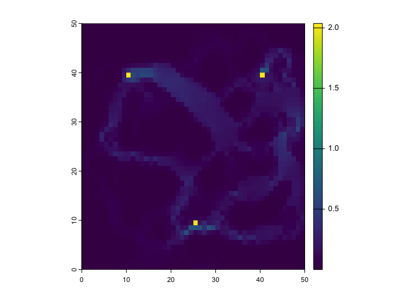
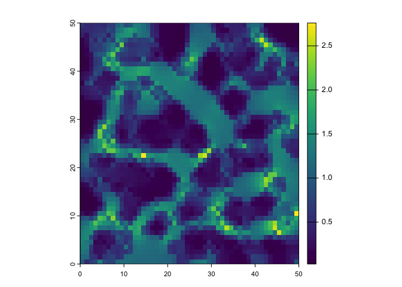

# circuitscaper

R interface to
[Circuitscape.jl](https://github.com/Circuitscape/Circuitscape.jl) and
[Omniscape.jl](https://github.com/Circuitscape/Omniscape.jl) via
JuliaCall.

## Overview

Landscape connectivity models estimate how easily organisms, genes, or
ecological processes can move across a landscape. Circuit theory-based
methods model the landscape as an electrical circuit in which current
flow across a resistance surface reveals connectivity patterns. This
approach captures all possible movement pathways simultaneously, making
it especially useful for identifying corridors and pinch points.

These methods are implemented in a pair of open-source Julia packages,
[Circuitscape](https://circuitscape.org) and
[Omniscape](https://docs.circuitscape.org/Omniscape.jl/latest/),
developed by Brad McRae, Viral Shah, Tanmay Mohapatra, Ranjan
Anantharaman, and collaborators. Circuitscape treats each cell as a node
in a circuit and computes current flow between focal sites. Omniscape
extends this by applying Circuitscape in a moving window across the
entire landscape, producing wall-to-wall connectivity maps without
predefined focal sites.

**circuitscaper** is an independent R package (not affiliated with the
Circuitscape development team) that provides an R-native interface to
both tools. Users work entirely in R with
[`terra::SpatRaster`](https://rspatial.github.io/terra/reference/SpatRaster-class.html)
objects while Julia handles computation behind the scenes.

## Installation

``` r
# Install from GitHub
remotes::install_github("matthewkling/circuitscaper")

# First time: install Julia and required packages
library(circuitscaper)
cs_install_julia()
```

## Example

``` r
library(circuitscaper)
library(terra)
#> Warning: package 'terra' was built under R version 4.3.3
#> terra 1.8.10

# Load an example resistance raster
resistance <- rast(system.file("extdata/resistance.tif", package = "circuitscaper"))

# Pairwise Circuitscape -- resistance matrix + cumulative current map
focal_sites <- matrix(c(10, 40, 40, 40, 25, 10), ncol = 2, byrow = TRUE)
result <- cs_pairwise(resistance, focal_sites)
plot(result$current_map)
```



``` r

# Omniscape -- wall-to-wall moving-window connectivity
result <- os_run(resistance, radius = 10)
plot(result[["normalized_current"]])
```



## Functions

| Function                                                                                           | Description                                    |
|----------------------------------------------------------------------------------------------------|------------------------------------------------|
| [`cs_pairwise()`](https://matthewkling.github.io/circuitscaper/reference/cs_pairwise.md)           | Pairwise effective resistance and current flow |
| [`cs_one_to_all()`](https://matthewkling.github.io/circuitscaper/reference/cs_one_to_all.md)       | One-to-all connectivity analysis               |
| [`cs_all_to_one()`](https://matthewkling.github.io/circuitscaper/reference/cs_all_to_one.md)       | All-to-one connectivity analysis               |
| [`cs_advanced()`](https://matthewkling.github.io/circuitscaper/reference/cs_advanced.md)           | Advanced mode with custom sources and grounds  |
| [`os_run()`](https://matthewkling.github.io/circuitscaper/reference/os_run.md)                     | Omniscape moving-window connectivity           |
| [`cs_locations()`](https://matthewkling.github.io/circuitscaper/reference/cs_locations.md)         | Create focal node raster from coordinates      |
| [`cs_setup()`](https://matthewkling.github.io/circuitscaper/reference/cs_setup.md)                 | Initialize Julia (called automatically)        |
| [`cs_install_julia()`](https://matthewkling.github.io/circuitscaper/reference/cs_install_julia.md) | Install Julia and required packages            |

## Requirements

- R \>= 4.0
- Julia \>= 1.9 (installed automatically via
  [`cs_install_julia()`](https://matthewkling.github.io/circuitscaper/reference/cs_install_julia.md))
- R packages: terra, JuliaCall

## Learn More

- [Getting started
  vignette](https://matthewkling.github.io/circuitscaper/articles/getting-started.html)
- [Circuitscape user
  guide](https://docs.circuitscape.org/Circuitscape.jl/latest/)
- [Omniscape
  documentation](https://docs.circuitscape.org/Omniscape.jl/latest/)
- McRae, B.H. (2006). Isolation by resistance. *Evolution*, 60(8),
  1551-1561.
- McRae, B.H. & Beier, P. (2007). Circuit theory predicts gene flow in
  plant and animal populations. *PNAS*, 104(50), 19885-19890.
- McRae, B.H., Dickson, B.G., Keitt, T.H. & Shah, V.B. (2008). Using
  circuit theory to model connectivity in ecology, evolution, and
  conservation. *Ecology*, 89(10), 2712-2724.
